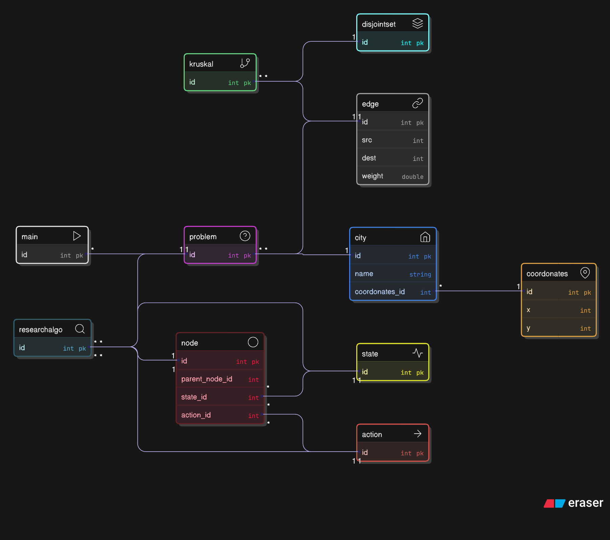

# TP4 – Recherche Informée  
Auteurs : Karam ELNASORY · Erkin Tunc BOYA · Semih DOYNUK  

Code source : [Répertoire de TP4](https://github.com/ErkinTunc/ARP-Recherche-Non-Inform-) 

---

# Contexte

Ce TP généralise le problème du cavalier vers le **problème du chemin Hamiltonien**, puis vers sa version pondérée : le **TSP** (Traveling Salesman Problem).  
Un **chemin Hamiltonien** est un chemin visitant chaque sommet **exactement une fois**.  
Un **TSP** cherche en plus un chemin **de coût minimal**.

→ Ces deux problèmes sont **NP-complets / NP-difficiles**, aucun algorithme polynomial n’est connu.  

**À retenir :**  
- Hamiltonien = couverture des sommets.  
- TSP = Hamiltonien + optimisation du coût.  
- Explosion combinatoire → approches non informées inadaptées.

Nous travaillons sur les capitales américaines définies dans `us_capitals.txt` (coordonées (x,y)).

---

# Exercice 1 – Un sacré voyage (TSP)

## Q1 — Modélisation constructive (5 éléments du cours)

### 1. Espace d’états
\[
s = (u, V)
\]
- \(u\) : la ville actuelle  
- \(V\) : l’ensemble des villes visitées  

**À retenir :**  
- Forme standard pour Hamilton/TSP : respecte la propriété de Markov.  
- Taille de l’espace ≈ \(O(n2^n)\).

### 2. État initial
\[
s_0 = (v_{depart},\{v_{depart}\})
\]

### 3. Actions
\[
a = v_i \quad \text{tel que } v_i \notin V
\]

### 4. Fonction de successeur
\[
succ((u,V), v_i) = (v_i,\; V \cup \{v_i\})
\]

### 5. Ensemble d’états but
\[
T = \{(u,V)\;|\; V = \text{ensemble complet des villes}\}
\]

### 6. Fonction de coût
\[
c((u,V), v_i) = d(u, v_i)
\]

### Distance entre deux villes
\[
d(u,v) = \sqrt{(x_u - x_v)^2 + (y_u - y_v)^2}
\]

**À retenir :**  
- Le graphe est complet et pondéré implicitement.  
- La distance euclidienne permet d'utiliser MST comme borne admissible.

---

## Q2 — Pourquoi la recherche non informée échoue ?

- BFS → explosion mémoire  
- DFS → suit des chemins profonds non optimaux  
- IDDFS → inutile car \(d = D\)

**Conclusion :**  
Les méthodes non informées ne savent ni **prioriser**, ni **couper** l’espace d’états.

---

## Rôle du DFS dans notre solution

DFS sert à :

1. obtenir une première solution réalisable,  
2. fournir une **borne supérieure (UB)** à Branch & Bound.

```
1 → 12 → 7 → 3 → 18 → ... → 50
Coût : ≈ 89 532.77
```


**À retenir :**  
- Une UB correcte est essentielle pour rendre BnB efficace.

---

# Exercice 2 – Algorithme A* avec heuristique MST

A* utilise une heuristique admissible :

- MST des villes non visitées  
- calcul via Kruskal + DisjointSet

**À retenir :**  
- A* équilibre coût passé g(n) et coût estimé h(n).  
- MST fournit une borne inférieure forte et admissible.

---

## Pourquoi MST est admissible ?

\[
\text{coût}(T^\*) \leq \text{coût}(P^\*) 
\]

**À retenir :**  
- Tout chemin Hamiltonien est un arbre couvrant → MST ≤ Hamiltonien optimal.  
- MST ne surestime jamais → heuristique admissible.

---

## Heuristique utilisée
\[
h(u,V) = MST(\text{villes non visitées})
\]

**Avantages :**  
- computation rapide  
- borne toujours valide  
- réduit drastiquement les explorations A*

---

## Résultat A*
Solution trouvée :(à compléter)
Coût :(à insérer)


**Observation :**  
A* explore beaucoup moins d'états que DFS.

---

# Exercice 3 – Branch and Bound

Borne inférieure :
\[
LB = g(u,V) + MST(V^c)
\]

Si :
\[
LB \ge UB
\]
→ on coupe la branche.

**À retenir :**  
- MST = LB  
- DFS = UB  
- BnB coupe tout sous-problème non prometteur  
- Beaucoup plus efficace qu’A* si UB est bonne.

---

## Résultat

| Algorithme        | États explorés | Coût final |
|-------------------|----------------|------------|
| DFS               | énorme         | mauvais    |
| A* (MST)          | moyen          | optimal    |
| Branch & Bound    | petit          | optimal    |

**À retenir :**  
- A* trie mais stocke beaucoup d’états.  
- BnB coupe massivement → mémoire minimale.

---

# UML du projet



**À retenir :**  
- Architecture modulaire séparant données, MST, et algorithmes de recherche.

---

# Organisation du code

- `City.java` — représentation d’une ville  
- `Coordinates.java` — coordonnées x,y  
- `Edge.java` — arête pondérée  
- `Kruskal.java` — calcul du MST  
- `DisjointSet.java` — union-find  
- `Problem.java` — définition du problème  
- `Node.java` — état de recherche  
- `Action.java` — déplacement  
- `Main.java` — exécution TP4  

**À retenir :**  
- Structure claire facilitant l’expérimentation d’autres heuristiques.

---

# Références

- TP4 : Recherche informée (Hamilton / TSP)
